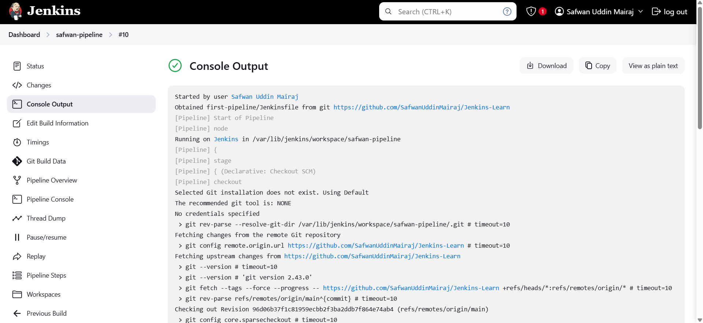

# A simple jenkins pipeline to verify if the docker slave configuration is working as expected.

- Go to New Item
- Create Pipeline
- Select Pipeline Script SCM
- Import this file by providing it's link and folder according to the fields
- Click Save

# Build the pipeline

- Click Build
- Click on three dots beside build to see how the pipeline is building, and that's it. Your pipeline has been build successfully

